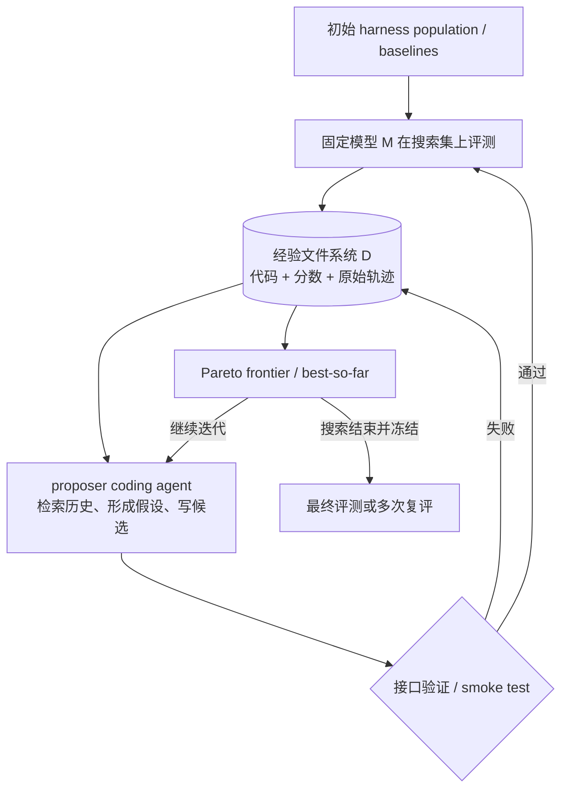
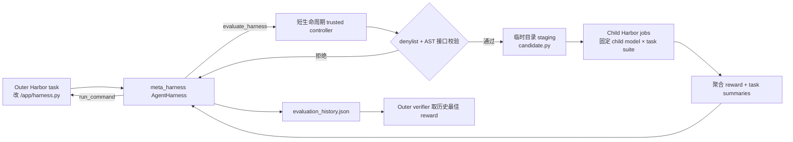

# Meta-Harness 方法与仓库 Pipeline 详解

> 本文基于仓库当前 `main` 分支的 `44b9942` 提交梳理，重点解释方法本身、两套论文参考实现，以及实验性的 Harbor 实现。论文中的数学检索实验没有随本仓库发布。论文原文见 [Meta-Harness: End-to-End Optimization of Model Harnesses](https://arxiv.org/abs/2603.28052)。

## 1. 一句话理解

Meta-Harness **不训练模型权重，而是让一个 coding agent 自动搜索“模型外面的程序”**：它读取历代候选 harness 的代码、分数和原始执行轨迹，诊断失败原因，写出新的 harness，再由固定评测器用固定 base model 跑分；新产生的代码、分数和轨迹继续写回文件系统，形成下一轮可检索的经验。

这里的 harness 是包在 LLM 外面的可执行逻辑，例如：

- prompt 怎样构造；
- 过去的样本、反馈或状态存什么；
- 何时检索、检索哪些内容、如何排序和压缩；
- 模型可以调用哪些工具；
- 模型输出后如何解析、验证、重试和继续执行；
- 长上下文如何摘要，任务何时结束。

因此，Meta-Harness 的搜索对象不是一段静态 prompt，也不是几个超参数，而是一个完整、可执行、可带状态的程序。

## 2. 核心角色与优化目标

| 符号/角色 | 含义 | 本仓库中的例子 |
|---|---|---|
| 固定模型 `M` | 真正解决下游任务的 solver/base model，搜索期间权重不变 | 文本分类的 GPT-OSS-120B；TB2 的 Claude Opus 4.6 |
| 候选 harness `H` | 包装 `M` 的程序，也是被搜索的对象 | `MemorySystem` 子类；`Terminus2` 子类 |
| proposer `P` | 阅读历史并编写新候选的 coding agent | 由 `claude_wrapper.py` 启动的 Claude Code/Opus |
| 任务集 `X` | 搜索集或 benchmark suite | 三个分类数据集；89 个 TB2 任务 |
| evaluator | 用固定协议执行候选并给出 reward/metrics | `inner_loop.py`、`benchmark.py` 或 Harbor verifier |
| 经验库 `D` | 所有历史代码、分数、轨迹和 proposer 日志 | `logs/`、`jobs/` 及其 JSON/JSONL 文件 |

论文把目标写成：

$$
H^{*} = \underset{H}{\operatorname{arg\,max}}\;
\mathbb{E}_{x \sim \mathcal{X},\; \tau \sim p_M(H,x)}
\left[r(\tau,x)\right]
$$

纯文本含义：在所有候选 harness `H` 中，寻找一个使任务和 rollout 上的期望奖励最大的 `H*`。

其中 `H` 决定模型每一步看到什么以及系统状态如何更新，`τ` 是完整 rollout，`r` 是任务最终奖励。若同时关心准确率和上下文成本，则不必提前压成一个标量，而可以保留非支配候选的 Pareto frontier：准确率越高越好、上下文越短越好。

需要特别注意：代码里出现的 `train` 或 `learn_from_batch`，通常指 **更新外部 memory state**，不是反向传播，也不会修改 base model 参数。

## 3. 方法为什么强调“文件系统中的完整历史”

普通 prompt/text optimizer 往往只把最近候选、标量分数或一段摘要交给下一轮 proposer。对 harness 搜索而言，这会丢掉关键的因果信息：一次早期的存储、检索或控制流决策，可能在几十步之后才造成失败。

Meta-Harness 的主要设计选择是把经验外置到文件系统：

- 每个候选的完整源代码；
- 每个任务或样本的得分；
- prompt、模型输出、工具调用、状态更新、失败信息；
- token、成本、轮数、运行时间；
- proposer 自己读过和改过哪些文件。

proposer 不需要把所有历史一次塞进上下文，而是像工程师一样用 `grep`、文件读取和脚本做选择性诊断。它可以跨很多候选比较同一失败模式、识别多个失败方案共有的改动、回退有害改动，或组合不同搜索分支中的有效机制。

这使外循环保持得非常简单：Meta-Harness 没有固定的 mutation operator、父代选择规则或只能局部修改的模板；“看哪些历史、从哪个候选出发、局部修补还是整体重写”都交给 coding agent 决定。

## 4. 通用外循环



### 4.1 “搜索集”与 train / val / test 的关系

“搜索集”不是 train、val、test 之外的第四份数据，而是 outer loop 视角下的**角色名称**：哪部分任务被反复用于给候选 harness 打分、选择候选和更新 frontier，哪部分就是 outer search 的 scoring set。标准三路划分中，它通常对应 validation set。

当前文本分类 reference 的实际数据流是：

```text
train examples
  → 交给 learn_from_batch
  → 构造候选自己的 memory state（不更新 solver 权重）

val examples
  → 只用当前 memory 做 predict 和计分
  → val accuracy / context cost 反馈给 proposer
  → 选择候选并更新 frontier

搜索完成并冻结 run
  → 加载保存下来的 memory state
  → 在 test examples 上做一次最终评测
```

因此可以用两个不同粒度来表述：

- **物理数据划分**仍然是 `train / val / test`；
- **外层选择意义上的 search set**主要就是 `val`；
- 如果泛指“搜索阶段允许影响最终 harness 的全部数据”，则 `train + val` 都属于 search-phase data：train 改变候选的 memory，val 改变 outer loop 选择哪个候选；
- `test` 不参与提案、选父本或 frontier 更新，只用于搜索结束后的最终报告。

这也是 validation 与 test 的根本区别：proposer 会反复看到 val 上的分数和失败轨迹，所以随着搜索轮数增加，候选可能逐渐过拟合 val；test 必须一直隔离才能估计未见数据上的泛化。当前发布仓库采用的是操作流程上的隔离——`--test` 会冻结 run 并阻止继续 evolution——但 test 文件本身随公开仓库存在，并不是密码学或权限层面的不可访问。

并不是所有领域都有天然的三路 split。例如当前 TB2 reference 在完整 89 个任务上搜索，这 89 个任务整体就是它的 search set；搜索后对赢家增加 trials 只能降低随机噪声，不等价于在未见任务 test set 上验证泛化。因此文档中的“搜索集”是跨领域的通用说法，映射到文本分类时应具体读作 validation set。

对应的实际阶段如下：

1. **定义边界**：固定 solver model、工具面、候选接口、搜索集、评测指标和预算。
2. **评测 baselines**：建立初始分数、轨迹和 frontier。
3. **提案**：proposer 读取历史，提出可证伪假设并把新候选写成 Python 文件。
4. **廉价验证**：先做 import、继承关系和最小运行检查，避免昂贵评测浪费在坏代码上。
5. **独立评测**：外部 orchestrator 执行候选；proposer 不负责给自己打分。
6. **记录经验**：把候选代码、逐任务结果、轨迹和资源消耗写回文件系统。
7. **更新 frontier**：保留整体最佳、逐任务最佳或 accuracy–cost Pareto 集。
8. **重复搜索**：下一轮可读取任意历史，而不只读取上一轮赢家。
9. **冻结与最终评测**：有独立 test split 时只在搜索完成后访问；高噪声 benchmark 则对赢家增加 trials。

这里的“一轮”专指最外层的一次 **evolution iteration**。通常从“proposer 基于当前历史提出候选”开始，到“候选被独立评测、结果写回并更新 frontier”结束：

```text
第 t 轮开始
  → proposer 读取第 0...t-1 轮的代码、分数和 traces
  → 生成本轮的 K 个候选文件
  → 对每个候选做廉价验证
  → 对通过验证的候选跑完整 search-set 评测
  → 聚合分数和成本，保存结果，更新 frontier
第 t 轮结束
```

baseline 评测通常是搜索前只运行一次的 `Phase 0`，不计入第 1 轮；最终 test 或增加 trials 的复评发生在所有搜索轮结束之后，也不属于普通的一轮。

要特别区分以下嵌套概念：

| 名称 | 所处层级 | 含义 |
|---|---|---|
| evolution iteration / 搜索轮 | 最外层 | proposer 产生一批候选，评测后更新一次历史/frontier |
| candidate | 一轮内部 | 一个新 Python harness；一轮可以生成 1、2 或 3 个候选 |
| candidate evaluation | 候选内部 | 把一个候选跑过整个 search set，并聚合为候选分数 |
| trial / attempt | 评测内部 | 某候选在某一道任务上的一次独立运行；可用多个 trials 降低随机性 |
| epoch / batch / example | 文本分类 inner loop | memory 按数据流预测、获得标签并更新 state 的训练/在线学习单位 |
| agent turn | 单个 trial 内部 | solver 看一次上下文并输出一次回复或 tool call；多轮 terminal agent 的一步 |
| LLM call | 最底层 | proposer 或候选实际调用一次模型 API；一个 turn 有时还可能触发辅助调用 |

因此，一轮通常包含很多次 LLM 调用。例如当前文本分类 reference 的一轮要求 proposer 生成 3 个候选，每个候选还要跨数据集逐样本运行；论文设置是一轮 2 个候选，20 轮共 40 个新候选。TB2 当前是一轮提出 1 个机制候选，通过 smoke test 后跑 `89 tasks × 2 trials = 178 trials`，而每个 trial 内又可能包含许多个 agent turns。不要把“20 轮搜索”理解成“模型只调用了 20 次”。

### 4.2 一个 benchmark 搜索多少轮

Meta-Harness 算法没有规定统一轮数；`N` 是由实验预算传入的 outer-loop 超参数。粗略的候选评测规模是：

```text
新候选数量 ≈ evolution iterations N × 每轮候选数 K
```

再乘以数据集数、seed 数、任务数和 trials，才是实际 inner evaluations。无效候选或 smoke-test 失败的候选仍可能占用一个提案轮，但不会进入完整昂贵评测。

| 场景 | 搜索轮数 | 每轮候选 | 完整运行的大致候选数 |
|---|---:|---:|---:|
| 当前文本分类代码默认值 | 20 | 3 | 最多 60 个新 memory systems，另加 baselines |
| 论文文本分类实验 | 20 | 2 | 40 个新候选 |
| 当前 TB2 代码默认值 | 5 | 1 | 最多 5 个新 agent harnesses，另加 2 个 baselines |
| 论文附录分析的 TB2 run | 10 | 1 | 10 个新候选；第 7 轮出现该 run 的赢家 |
| 论文数学检索实验 | 40 | 每轮数量可变 | 共生成 109 个候选，在 250 个 search problems 上搜索；当前仓库未发布该实现 |
| Harbor pilot 默认 suite | 不使用固定 `--iterations` | outer agent 自主修改 | `eval_budget=4`，即最多调用 4 次候选评测；collection suites 为 8 |

[`text_classification/meta_harness.py`](reference_examples/text_classification/meta_harness.py) 的 `--iterations` 默认是 20，[`terminal_bench_2/meta_harness.py`](reference_examples/terminal_bench_2/meta_harness.py) 默认是 5。这个参数表示**本次命令再运行多少轮**：如果已有 5 轮历史，再执行 `--iterations 5`，会续跑第 6–10 轮；只有加 `--fresh` 才会清理对应 run 的旧搜索记录后从头开始。

选择轮数时通常先做 3–5 个短轮来调通 candidate contract、skill、日志和评测，再决定是否投入 10–20 轮或更多。停止条件不一定只是达到固定 N，也可以是预算耗尽、连续多轮 frontier 不再改善，或已经找到满足目标的 accuracy/cost 点。论文也把 3–5 轮短跑作为正式长跑前的调试建议；典型完整 run 约为 20 轮、总计约 60 个 harness evaluations，但昂贵的 TB2 与便宜的分类任务不应机械使用同一预算。

## 5. 仓库布局

| 路径 | 作用 |
|---|---|
| [`README.md`](README.md) | 仓库总览与两个 reference experiment 的入口 |
| [`ONBOARDING.md`](ONBOARDING.md) | 把新领域整理成 `domain_spec.md` 的访谈式模板 |
| [`reference_examples/text_classification/`](reference_examples/text_classification/) | 搜索文本分类 memory system，具有明确的 train/val/test 隔离 |
| [`reference_examples/terminal_bench_2/`](reference_examples/terminal_bench_2/) | 搜索 Terminal-Bench 2 agent scaffold，使用 Harbor 管理任务与 sandbox |
| [`experimental/harbor_meta_harness/`](experimental/harbor_meta_harness/) | 把“改 harness”本身包装成 Harbor 外层任务的实验性嵌套实现 |

论文还研究了奥赛数学的检索 harness，但本仓库的发布版只包含文本分类和 Terminal-Bench 2 两套论文参考代码。

### 5.1 三个实验目录不是三个连续步骤

它们是三套可以分别进入、分别安装依赖和分别运行的实验：

```text
meta-harness/
├─ reference_examples/text_classification/   论文场景 A：搜索 memory 管理代码
├─ reference_examples/terminal_bench_2/      论文场景 B：搜索 terminal agent scaffold
└─ experimental/harbor_meta_harness/         工程 pilot：让“搜索 harness”本身成为 Harbor 任务
```

| 目录 | 被优化的 Python 对象 | 一次候选如何得分 | Harbor 在哪里 | 定位 |
|---|---|---|---|---|
| `text_classification` | `MemorySystem` 子类 | train 构造 memory，val 计算分类 accuracy/context cost | 不使用 Harbor，由本地 `inner_loop.py` 评测 | cleaned paper reference |
| `terminal_bench_2` | `Terminus2` 子类 `AgentHarness` | 候选在 TB2 任务 sandbox 中操作终端，verifier 返回 reward | Harbor 是内层任务执行器 | cleaned paper reference |
| `harbor_meta_harness` | 可编辑的 terminal `AgentHarness` 文件 | outer agent 调 `evaluate_harness`，controller 再启动一批 child Harbor jobs 聚合得分 | outer 优化任务和 inner 候选评测形成嵌套 Harbor 结构 | experimental pilot，不是论文主结果 |

#### `reference_examples/text_classification/`

这个目录研究的问题是：**固定分类模型不变，应该如何管理外部 memory，才能让后续分类更准确且 prompt 更短？**

```text
候选 MemorySystem
  ├─ learn_from_batch(train results)  更新 Python/JSON memory state
  ├─ predict(val input)               选择并组织 context，调用固定 solver
  └─ get_state/set_state              保存并恢复 memory

val accuracy + memory context chars
  → outer proposer 的搜索反馈
```

主要文件分工是：

- [`meta_harness.py`](reference_examples/text_classification/meta_harness.py)：最外层 evolution loop；
- [`memory_system.py`](reference_examples/text_classification/memory_system.py)：候选必须实现的接口；
- [`agents/`](reference_examples/text_classification/agents/)：baselines 和 proposer 生成的新候选；
- [`inner_loop.py`](reference_examples/text_classification/inner_loop.py)：执行单个 memory candidate 的 train/val/test 流程；
- [`benchmark.py`](reference_examples/text_classification/benchmark.py)：批量调度 dataset × candidate × model × seed，并汇总 frontier；
- [`data/`](reference_examples/text_classification/data/)：分类数据、加载器和答案 evaluator。

这里的“memory”是候选 Python 对象维护的外部状态，不是模型参数，也不是 Harbor agent 的对话历史。

#### `reference_examples/terminal_bench_2/`

这个目录把被搜索对象扩大成完整 terminal agent scaffold。它研究的是：**固定任务模型和 TB2 evaluator 后，怎样改 agent loop、工具、上下文和完成条件，能解决更多长时程终端任务？**

```text
外部 meta_harness.py
  → proposer 写 agents/<candidate>.py
  → import / Terminus2 继承检查
  → extract-elf smoke test
  → Harbor 为每个 TB2 task 创建 sandbox
  → candidate 在 sandbox 中反复调用模型和终端工具
  → task verifier 返回 reward
  → 汇总 pass rate、turns、tokens、cost
```

主要文件包括：

- [`baseline_kira.py`](reference_examples/terminal_bench_2/agents/baseline_kira.py)：1,185 行的主要工程父本；
- [`baseline_terminus2.py`](reference_examples/terminal_bench_2/agents/baseline_terminus2.py)：vanilla Terminus2 对照入口；
- [`meta_harness.py`](reference_examples/terminal_bench_2/meta_harness.py)：提案、验证、评测、记录和 frontier；
- [`scripts/run_eval.sh`](reference_examples/terminal_bench_2/scripts/run_eval.sh)：把指定 import path 交给 Harbor 执行。

这里 Harbor 只是**内层 evaluator/任务运行基础设施**。outer proposer 和 orchestration 仍由仓库外层脚本直接启动。

#### `experimental/harbor_meta_harness/`

这个目录进一步实验：**能否把“请一个 agent 修改 harness，并允许它调用受限评测工具”本身也定义成一项 Harbor task？**

```text
outer Harbor job
  └─ Meta-Harness agent
       ├─ 查看并修改 /app/harness.py
       └─ 调用 evaluate_harness(candidate_source)
            └─ trusted controller
                 ├─ 校验候选、检查预算和泄漏规则
                 ├─ 启动多个短生命周期 child Harbor jobs
                 └─ 聚合 hidden suite reward 返回 outer agent
```

它因此是“Harbor 里面再调用 Harbor”的嵌套结构。关键文件是：

- [`agents/meta_harness.py`](experimental/harbor_meta_harness/agents/meta_harness.py)：负责改 harness 的 outer agent；
- [`controller.py`](experimental/harbor_meta_harness/controller.py)：可信评测边界、预算、校验和 child job 调度；
- [`suite.toml`](experimental/harbor_meta_harness/suite.toml)：默认三任务评测套件；
- [`agents/baseline.py`](experimental/harbor_meta_harness/agents/baseline.py) 与 [`agents/inspect_validate.py`](experimental/harbor_meta_harness/agents/inspect_validate.py)：1-turn 弱起点和 6-turn 对照候选。

这个 pilot 主要验证嵌套评测、工具权限、candidate isolation 和 eval budget，而不是提供论文最终 TB2 harness。运行前两个 reference experiment 不依赖这个目录。

## 6. 文本分类实现：搜索 memory system

### 6.1 调用链

```text
meta_harness.py
  ├─ Phase 0: benchmark.py 评测 no_memory / fewshot_all
  ├─ claude_wrapper.py + .claude/skills/meta-harness/SKILL.md
  │    └─ 读取历史，写 agents/<candidate>.py 和 pending_eval.json
  ├─ import 校验候选
  ├─ benchmark.py 生成 dataset × memory × model × seed 作业
  │    └─ python -m text_classification.inner_loop
  │         ├─ data/api.py 加载 train / val / test
  │         ├─ MemorySystem.learn_from_batch() 构造外部状态
  │         ├─ MemorySystem.predict() 调固定 LLM
  │         └─ evaluator 计算准确率及附加指标
  ├─ 汇总 val.json，更新 frontier_val.json
  └─ 搜索冻结后，显式 --test 复用 memory.json 评测 test split
```

三个最重要的入口分别是：

- [`meta_harness.py`](reference_examples/text_classification/meta_harness.py)：迭代级 outer loop；
- [`benchmark.py`](reference_examples/text_classification/benchmark.py)：跨数据集、候选、模型和 seed 的并发调度层；
- [`inner_loop.py`](reference_examples/text_classification/inner_loop.py)：一个 memory system 在一个数据集上的单次训练与评测。

### 6.2 候选接口

所有候选都继承 [`MemorySystem`](reference_examples/text_classification/memory_system.py)，核心接口是：

```python
class MemorySystem(ABC):
    def predict(self, input: str) -> tuple[str, dict]: ...
    def learn_from_batch(self, batch_results: list[dict]) -> None: ...
    def get_state(self) -> str: ...
    def set_state(self, state: str) -> None: ...
```

- `predict` 必须在看到当前样本真值前生成答案；
- `learn_from_batch` 在整批预测完成、评测器给出反馈后更新状态；
- `get_state` / `set_state` 让 memory 可以 checkpoint，并在最终 test 时原样恢复；
- 候选应通过 `self.call_llm(prompt)` 调模型，这样框架能按线程记录实际 prompt、长度和 hash；
- 并行评测会并发调用 `predict`，所以候选需要保证该路径线程安全。

搜索空间因此可以覆盖原始示例存储、错误记忆、反思摘要、检索算法、标签覆盖、对比样本、两阶段验证和 prompt 架构，而不只是 `top_k` 一类参数。

### 6.3 当前发布版的默认配置

[`config.yaml`](reference_examples/text_classification/config.yaml) 当前设置为：

| 项目 | 默认值 |
|---|---|
| solver | `openrouter/openai/gpt-oss-120b` |
| 搜索数据集 | `USPTO`、`Symptom2Disease`、`LawBench` |
| 数据量 | USPTO `50/30/100`；S2D `200/50/212`；LawBench `200/50/100`（train/val/test） |
| inner-loop 模式 | `offline`，1 epoch，batch size 1 |
| seeds | `[42]` |
| benchmark 并发 | 16 |
| baselines | `no_memory`、`fewshot_all` |

`no_memory` 每次只把当前问题交给模型，不学习任何状态。`fewshot_all` 在训练时积累 `(raw_question, ground_truth)`，推理时把示例放进 prompt；对输入使用稳定 hash 来确定采样/顺序，当前代码实际还受 `MAX_CHARS = 30000` 的字符上限约束。

### 6.4 online 与 offline 两种内循环

`inner_loop.py` 同时支持两种语义：

**Online 模式**

```text
取一个 batch
  → 对 batch 中所有样本先 predict（看不到本 batch 真值）
  → evaluator 产生正确性/附加指标
  → 把 input、prediction、ground_truth、was_correct 交给 learn_from_batch
  → 下一个 batch
```

同一 batch 内先统一预测再统一学习，避免前一个样本的答案泄漏给本 batch 后面的样本。

仓库中没有一个字面名为 `sequential` 的第三种 mode。如果用 “sequential mode” 描述“样本一个接一个到达，答完一个才看到标签并更新 memory”，它实际对应：

```yaml
inner_loop:
  mode: online
  batch_size: 1
```

这时第 (i) 个样本的执行顺序为 `predict(x_i) → 得到 y_i/反馈 → learn_from_batch([i])`，第 (i+1) 个样本可以使用刚更新的 memory。若 `batch_size > 1`，batch 之间仍是顺序的，但同一 batch 内会并行预测，并在全部预测完成后统一学习，因此同 batch 样本互相看不到答案。

不要把这种**数据语义上的顺序学习**与**计算调度上的串行执行**混为一谈。若只是希望避免同时发出多个评测/API 作业，应把文本分类的 `benchmark.concurrency` 设为 1，或给 TB2 传 `--concurrent 1`；这只影响速度和限流，不会把 `offline` 变成 `online`，也不会改变 memory 更新规则。

**Offline 模式（当前默认）**

```text
训练阶段：带真值样本 → learn_from_batch，可跑多个 epoch
  → 每个 epoch 在 val 上评测并保存最佳 memory state
  → 恢复最佳 checkpoint
评测阶段：冻结 memory，只调用 predict，不再更新
```

在 evolution 的 val-only 路径中，代码会跳过昂贵的训练集回测；训练后的 `memory.json` 仍会保存，以便最终 test 直接加载，避免重新训练导致状态漂移。

### 6.5 数据、指标和调度

[`data/api.py`](reference_examples/text_classification/data/api.py) 使用官方三路 split；MCE 数据集按 seed 分别 shuffle 后截取，transfer/OOD 数据集还支持按标签平衡抽样。不同数据集由 [`data/evaluators.py`](reference_examples/text_classification/data/evaluators.py) 做规范化：

- 所有任务都有 exact-style `accuracy`，这是当前 frontier 的主指标；
- LawBench 额外计算 precision、recall、per-example F1 和 micro-F1；
- USPTO 额外记录 reactant set 的 Jaccard similarity；
- 主 frontier 当前仍按 accuracy，而不是这些附加指标排序。

`benchmark.py` 自动发现 `agents/*.py`，为完整笛卡尔积生成子进程，并用 semaphore 控制并发。失败作业最多重试两次。只有所有配置 seed 都存在时，该 `(model, dataset, memory)` 结果才会进入汇总；多 seed 时 `correct/total` 先求和再算总 accuracy。

结果目录为：

```text
logs/<run>/
  evolution_summary.jsonl
  frontier_val.json
  pending_eval.json
  claude_sessions/<timestamp>_iterN/
  <dataset>/<memory>/<model>[_seedN]/
    val.json
    memory.json
    log.jsonl
  results/<dataset>/<memory>/<model>[_seedN]/
    test.json
```

这里记录的 context cost 是 `完整 prompt 字符数 - 当前输入字符数` 的平均值，单位是 **字符**，不是 tokenizer token。`benchmark.py` 会：

1. 为每个数据集选 accuracy 最高、平分时 context 更短的候选；
2. 对每个候选计算跨数据集平均 accuracy 和平均非零 context 长度；
3. 计算 accuracy–context 的非支配 Pareto frontier；
4. 写入 `frontier_val.json`，供下一轮 proposer 检索。

### 6.6 proposer 在一轮中做什么

文本分类专用 skill 要求 proposer：

1. 补写尚缺失的历史迭代报告；
2. 阅读 `evolution_summary.jsonl`、`frontier_val.json`、配置和近期逐样本轨迹；
3. 提出三个针对不同机制、可证伪的假设；
4. 先在 `/tmp` 用真实日志样本原型化检索/学习逻辑；
5. 写三个全新的 `agents/<name>.py`；
6. 自查是否只是参数调优，并做 import 验证；
7. 写 `pending_eval.json`，把候选交回 outer loop。

outer loop 本身不会相信 proposer 的口头输出，只读取约定路径上的 `pending_eval.json`，再次做 import 校验，然后才进入 benchmark。

### 6.7 held-out test 隔离

默认 evolution 只生成和读取 `val.json`。完成选择后必须显式执行：

```bash
cd reference_examples/text_classification
uv run python meta_harness.py --run-name my-run --test
```

finalization 会测试 baselines、各数据集最佳候选和 aggregate Pareto 候选，并把状态写入 `finalized.json`。只有 test 结果完整时状态才变为 `complete`；完成后同一 run name 被永久禁止继续 evolution。

这是很实用的操作隔离，但不是安全边界：test 数据本身就在公开仓库里，恶意或不守约束的 proposer 仍可能直接读取它。

### 6.8 最小运行命令

```bash
cd reference_examples/text_classification
uv sync
uv run python meta_harness.py --iterations 1 --run-name demo
uv run python benchmark.py --logs-dir logs/demo --results
```

只跑一个候选、一个数据集的命令见该目录的 [`README.md`](reference_examples/text_classification/README.md)。

## 7. Terminal-Bench 2 实现：搜索 agent scaffold

### 7.1 调用链

```text
meta_harness.py
  ├─ Harbor 评测 Terminus-KIRA / Terminus2 baselines
  ├─ Claude Code proposer 读取 jobs/ 中成功与失败 trajectories
  ├─ 写 agents/<candidate>.py + pending_eval.json
  ├─ 精确 import/继承校验
  ├─ extract-elf 单任务 smoke test
  ├─ scripts/run_eval.sh
  │    └─ harbor run: 89 tasks × 2 trials，远程 runloop/modal sandbox
  ├─ 从每个 trial/result.json 汇总 pass rate、tokens、cost、turns
  └─ 更新逐任务 frontier 和整体最佳；可选对赢家做 5-trial 复评
```

入口是 [`meta_harness.py`](reference_examples/terminal_bench_2/meta_harness.py)，Harbor shell 封装是 [`scripts/run_eval.sh`](reference_examples/terminal_bench_2/scripts/run_eval.sh)。当前默认搜索配置为：

- solver：`anthropic/claude-opus-4-6`；
- 完整 89-task `terminal-bench@2.0`；
- 每任务 2 trials；
- 并发 50；
- Runloop 为默认 sandbox，也支持 Modal；
- 全局 wall-clock timeout 默认 8 小时。

### 7.2 被搜索的 `AgentHarness`

候选必须是一个完整 Python 文件，类名固定为 `AgentHarness`，并继承 Harbor 的 `Terminus2`；导入形式是：

```text
agents.<candidate>:AgentHarness
```

搜索起点 [`baseline_kira.py`](reference_examples/terminal_bench_2/agents/baseline_kira.py) 本身已经是较复杂的 harness：

- 用原生 function calling 暴露 `execute_commands`、`task_complete`、`image_read`；
- 每次命令经 tmux 执行，并追加唯一 marker，通过轮询提早发现命令结束；
- 单条命令等待时间最多 60 秒，终端 observation 截断到 30KB；
- 直接经 LiteLLM 调模型，带重试、Anthropic prompt caching 和 token/cost 统计；
- 上下文溢出时调用继承来的 summarization/handoff；
- `task_complete` 需要二次确认，第一次会展示原任务、当前终端和 QA checklist；
- 每轮把 reasoning、tool call、observation、token 和 cost 写入 trajectory。

因此 proposer 可以改的不只是 system prompt，还包括工具 schema、工具解析、命令执行、重试、上下文管理、agent loop、完成条件和多模态路径。

### 7.3 一轮搜索

TB2 专用 skill 当前要求每轮产生一个、且只验证一个机制假设。outer loop 随后执行两级廉价检查：

1. 精确加载 import path，确认目标是 class 且确实继承 `Terminus2`；
2. 在 `extract-elf` 上跑 1 task × 1 trial，排除只能 import、不能真实运行的候选。

通过后才启动默认的 `89 × 2 = 178` 个 trial。`run_eval.sh` 还会在真正启动 Harbor 前重复执行 class 校验。

每个 trial 都独立计入分母：缺少 `result.json`、JSON 损坏、无 verifier reward、运行报错都会按 0 分处理。整体指标是：

```text
overall pass rate = 所有成功 trial 数 / 所有 trial 数
```

它不是“先算每个任务 pass rate，再对 89 个任务做无权平均”，虽然 trial 数一致时二者数值相同。框架同时记录每任务 pass rate、输入/输出/cache tokens、美元成本、turn 数和 API 调用次数。

`frontier_val.json` 中有两个概念：

- 每个任务分别记录历史上该任务 pass rate 最高的 agent，这可能形成一个无法实际部署的“拼接式 frontier”；
- `_best` 只记录整体 pass rate 最高的某一个完整 agent，它才是最终复评对象。

`--full-eval` 会对整体赢家在同一 89-task benchmark 上改跑 5 trials，以降低两次试验带来的方差。

### 7.4 搜索集与最终评测的边界

TB2 参考实现与文本分类不同：它在同一套公开 89 tasks 上搜索，也在这套任务上做 5-trial 复评，没有独立 held-out task split。论文把它定位为 benchmark discovery setting，并辅以人工检查和 task-specific string leakage 审计。

所以应把这里的结果理解为“自动化 benchmark/harness engineering”，而不是严格意义上的未见任务泛化估计。若迁移到私有业务，最好另外保留 proposer 无法访问的 held-out suite。

### 7.5 运行方式与成本

先做 provider-free 校验和单任务 smoke check：

```bash
cd reference_examples/terminal_bench_2
uv sync
uv run python -m unittest -v tests.test_meta_harness.AgentClassValidationTests
uv run bash scripts/run_eval.sh agents.baseline_kira:AgentHarness full 1 1 -i extract-elf
```

再启动一轮搜索：

```bash
uv run python meta_harness.py --iterations 1 --run-name demo
```

仓库 README 估计默认 Opus 4.6、89×2、并发 50 的一轮约需 4–6 小时、约 500 美元；吞吐不足会把很多任务表现为 timeout failure，因此 API tier、并发和超时都属于评测可靠性的一部分。

## 8. 实验性 Harbor Meta-Harness：嵌套的“agent 优化 agent”

[`experimental/harbor_meta_harness/`](experimental/harbor_meta_harness/) 不是前两套论文 reference code 的简单副本，而是一个更显式的 pilot：把“改进 `/app/harness.py`”本身做成一个 Harbor task，并给 outer model 一个有次数上限的 `evaluate_harness` 工具。



### 8.1 外层 agent

[`agents/meta_harness.py`](experimental/harbor_meta_harness/agents/meta_harness.py) 给 outer model 两个工具：

- `run_command`：检查和编辑外层 sandbox 中的 `/app/harness.py`；
- `evaluate_harness`：下载当前代码并交给 trusted controller 打分。

`EvaluationState` 是 frozen dataclass，保存不可变的 remaining budget 和 append-only history。默认 suite 只有 4 次评测机会；替代 collection suites 使用 8 次。每次调用都会扣预算，即使候选被拒绝或 evaluator 出错。

outer agent 结束后会上传 `/app/evaluation_history.json`。外层 verifier 检查预算账本一致性，然后取所有 accepted evaluations 中的 **历史最高 reward**，而不是最后一次 reward。

### 8.2 trusted controller 与隔离

[`controller.py`](experimental/harbor_meta_harness/controller.py) 的流程是：

1. 读取 suite 的任务、child model、sandbox backend、attempts、预算、聚合方式和 timeout；
2. 计算候选源码 SHA-256；
3. 做源码级 denylist 检查：通用禁词加每个任务 `task.toml` 中的 `forbidden_references`；
4. 用 AST 确认存在继承 `BaseAgent` 的 `AgentHarness`，且类中定义了 `async run`；
5. 将源码复制到临时目录的 `candidate.py`；
6. 为 suite 中每个任务启动短生命周期 child Harbor subprocess；
7. 读取 verifier reward，失败、超时或结果畸形按 0 分；
8. 用 `mean`、`min` 或 `fraction_solved` 聚合任务 reward。

重要的 trust boundary 是：候选代码不会被长期存活的 outer agent 或 controller 进程 `import`，只通过临时 `PYTHONPATH` 暴露给 child Harbor job。它仍然是任意 Python，安全性最终依赖 child sandbox；字符串 denylist 主要防直接 benchmark 泄漏，并不是通用恶意代码分析器。

### 8.3 默认 suite

[`suite.toml`](experimental/harbor_meta_harness/suite.toml) 默认包含三个手写数据处理任务：ledger reconciliation、event deduplication 和 budget rollup；child model 是 `openai/gpt-5.4-nano`，每任务 1 attempt，聚合为 mean，评测预算为 4。

seed harness 只有一个 terminal turn，故意留下较大的优化空间；仓库另附一个 6-turn、强调 inspect/validate 的强基线。`suites/` 还提供 TB2 Easy、HumanEvalFix lite 和 CodePDE 的试验配置，数据集本体需要另行下载到被忽略的 `datasets/`。

本地的 controller 单测不调用真实 provider：

```bash
cd experimental/harbor_meta_harness
uv sync
uv run pytest -q
```

## 9. 论文设定与当前发布代码不要混为一谈

| 项目 | 论文描述 | 当前仓库默认实现 |
|---|---|---|
| 文本分类搜索 | online classification；20 iterations × 2 candidates；初始 population 包含 zero/few-shot/ACE/MCE | `config.yaml` 默认为 offline 1 epoch；skill 要求每轮恰好 3 candidates；baseline 仅 `no_memory`、`fewshot_all` |
| 文本分类选择 | search-set 表现选择，最后看 held-out test；报告 token 级 context | 代码用 val/test 做操作隔离；frontier 的 cost 实际按 prompt 字符数计算 |
| TB2 | 完整 89 tasks 上进行 discovery，并报告多模型结果 | 发布脚本默认只配置 Opus 4.6、2 search trials；`--full-eval` 对赢家跑 5 trials |
| 数学检索 | 40 iterations、250 个搜索题、109 个候选，最终在未见题和未见模型上测试 | 本仓库没有这套 reference implementation |
| 最终优化 harness | 论文附录描述了发现的分类、数学和 TB2 harness | TB2 最终 artifact 位于独立仓库；本仓库主要提供搜索框架、baseline 和可运行入口 |

因此，复现实验时应以“对应实验目录的 README + 当前配置 + 当前代码”为执行真相；论文数字用于理解方法和原始实验，不应直接当成这份 cleaned release 一键运行后的预期输出。

### 9.1 四种“搜索起点”并不是同一种 baseline

先区分 outer loop 中的三个角色：

```text
复杂的 proposer（当前是 Claude Code）
  │ 读取候选源码、分数和执行轨迹，负责提出并写出新代码
  ▼
候选 harness（真正被搜索的程序）
  │ 包装固定 solver，在任务评测时独立运行
  ▼
固定 evaluator
    返回 accuracy / pass rate / context cost 等指标
```

proposer 相当于“写实验代码的研究员”，seed harness 相当于“研究员拿到的第一版程序”。二者没有必要具有相同复杂度。更重要的是，候选进入正式评测后，proposer 不会在旁边替它解题；任务只能由候选 harness、固定 solver 和允许的工具完成。因此，一个强 coding proposer 配一个简单 seed，不等于评测时偷偷给简单 seed 增加了 Claude 的能力。

四套设置选择不同强度的 seed，是因为它们要回答的问题不同：

| 场景 | Phase 0 / 初始集合里有什么 | 新候选实际从哪里产生 | 主要目的 |
|---|---|---|---|
| 当前文本分类发布版 | `no_memory`、`fewshot_all` | proposer 可读取两者及全部历史，再写新的 `MemorySystem` | 给出透明、可运行的最小 reference flow |
| 论文文本分类实验 | zero-shot、不同 few-shot、ACE、MCE | 从一个多样化初始 population 出发，不是只沿一个 parent 单链变异 | 与强手工方法比较，并让搜索直接复用成熟 memory 思路 |
| 当前 TB2 reference | Terminus-KIRA、vanilla Terminus2 都先评测 | prompt 明确指定 `baseline_kira.py` 为主要 parent | 在昂贵、长时程任务上做强基线之上的 frontier search |
| 实验性 Harbor pilot | 一个故意受限为 1 turn 的 terminal harness | outer agent 直接编辑 `/app/harness.py` | 先验证嵌套优化、隔离、预算和评分闭环确实工作 |

#### A. 当前文本分类发布版：两个 baseline 具体有多简单

[`no_memory.py`](reference_examples/text_classification/agents/no_memory.py) 的逻辑近似于：

```python
def predict(x):
    return llm(current_task_prompt + x)

def learn_from_batch(results):
    pass
```

它的 state 始终为空，不保存做过的题、正确答案或失败原因。它回答的是“完全不使用跨样本 memory 时，固定 solver 能做到什么程度”。

[`fewshot_all.py`](reference_examples/text_classification/agents/fewshot_all.py) 复用 [`fewshot_memory.py`](reference_examples/text_classification/agents/fewshot_memory.py)，逻辑近似于：

```python
def learn_from_batch(results):
    for result in results:
        memory.append((result.raw_question, result.ground_truth))

def predict(x):
    examples = stable_sample_and_shuffle(memory, seed=hash(x))
    examples = truncate_at_30000_chars(examples)
    return llm(format_as_QA(examples) + x)
```

这里的 `all` 表示 `max_examples=9999`，不是保证每次真的把无限多示例全部塞入 prompt；实际还受 30,000 字符上限约束。它没有语义检索、标签均衡、错误反思、压缩或二阶段验证，只是“积累原始标注示例，再做 few-shot”。

outer loop 会先评测这两个 baseline，把源码、分数和 traces 放入历史。之后 proposer 并非只能把 `fewshot_all` 的某个参数从 9999 改成 100；它可以写出全新的 memory 管理，例如：

```text
全量 few-shot
  → 只检索与当前问题相似的 top-k
  → 给稀有标签保留最低配额
  → 同时取支持样本与容易混淆的反例
  → 先 draft 标签，再围绕 draft 做第二次定向检索和验证
```

所以这两个简单 baseline 的作用主要是提供“无 memory”和“最朴素 memory”两个坐标原点，便于读者看懂闭环；它们不是论文原始搜索种群的完整复刻。

#### B. 论文文本分类：ACE/MCE 是初始种群成员，不只是图上的对照线

论文实验将初始种群写成：

```text
H0 = {zero-shot, few-shot, ACE, MCE}
```

其中 ACE（Agentic Context Engineering）把随任务积累的 context 当作可演化 playbook，通过 generation、reflection、curation 逐步补充和整理策略；MCE（Meta Context Engineering）更进一步，让 meta-agent 演化“如何构造 context”的自然语言 skill，base-agent 再执行 skill 来更新 context artifact。它们都比“保存原始 Q/A”包含更多人工设计好的更新流程和结构先验。

这里的“较强起点”指机制成熟、能提供有价值的代码结构和行为轨迹，并不表示 ACE/MCE 在每个数据集上都严格支配 few-shot。论文表中，Few-shot (all)、ACE、MCE 的三数据集平均准确率分别约为 40.8、40.9、40.0；ACE 在 LawBench 更强，MCE 在 Symptom2Disease 更强。这样的多样性正适合作为 population：proposer 可以观察各方法“在哪里成功、在哪里失败、为成功付出了多少 context”，再组合或替换机制，而不用先花十几轮重新发明 reflection 或 skill library。

论文运行 20 个 evolution iterations、每轮 2 个新 harness，共评测 40 个新候选。最终方法的可信比较不是“比 zero-shot 提升多少”，而是能否超过初始 population 中最强的 ACE/MCE，并形成更好的 accuracy-context Pareto frontier。

还要注意发布差异：当前仓库的 `agents/` 没有随附可执行 ACE/MCE 实现。[`benchmark.py`](reference_examples/text_classification/benchmark.py) 中的 `MCE_REFERENCE` 只是用于画图的静态复现结果；其中还记录了 ACE 和 MCE 平均约 202,968、114,028 个 context 字符。静态点不能充当当前 outer loop 可读取、复制和修改的 parent。因此，直接运行当前 `config.yaml` 得到的是“从两个简单 baseline 开始的 cleaned reference”，不是论文的四类初始 population。

#### C. TB2：严格说是“评测两个强 baseline，以 KIRA 为主要 parent”

[`meta_harness.py`](reference_examples/terminal_bench_2/meta_harness.py) 的 Phase 0 会评测：

```python
BASELINES = [
    ("kira-baseline", "agents.baseline_kira:AgentHarness"),
    ("terminus2-baseline", "agents.baseline_terminus2:AgentHarness"),
]
```

但生成新候选时的 prompt 明确写着：

```text
Start from agents/baseline_kira.py as the parent.
```

所以 Terminus2 主要提供原版比较坐标，KIRA 才是候选默认继承和修改的工程父本。[`baseline_terminus2.py`](reference_examples/terminal_bench_2/agents/baseline_terminus2.py) 在本仓库看起来只有 5 行，是因为它直接 alias Harbor 包中的完整 `Terminus2` 类，并不代表实际 agent 只有 5 行。[`baseline_kira.py`](reference_examples/terminal_bench_2/agents/baseline_kira.py) 则在本地有 1,185 行，已经包含：

- 原生 function calling，而不是让模型输出 JSON/XML 后再解析；
- tmux 命令执行、结束 marker 轮询、输出截断和 timeout；
- API 重试、prompt caching、token/cost 统计；
- context 过长时的 summarization/handoff；
- `task_complete` 二次确认、QA checklist 和完整 trajectory 日志。

这类基础设施不是 TB2 实验想重新发现的目标。默认一个候选就要跑 `89 tasks × 2 trials = 178 trials`；如果从只能调用一次 shell 的弱 harness 开始，大多数复杂任务都会得 0，proposer 只看到稀疏、低区分度的反馈，而且大量预算会浪费在重建终端 loop、超时处理和上下文交接。用 KIRA 起步后，搜索可以直接研究边际但高价值的变化，例如环境 bootstrap、工具 schema、错误恢复、完成判定和 turn/context 分配。

因此 TB2 支持的是更强的结论：“自动搜索能否超过成熟的手工 agent scaffold”，而不是“能否把一个玩具 terminal loop 修到能工作”。

#### D. Harbor pilot：1-turn 弱起点是在做闭环单元测试

[`tasks/select-harness/environment/harness.py`](experimental/harbor_meta_harness/tasks/select-harness/environment/harness.py) 的核心限制是：

```python
for _ in range(1):
    response = await model(..., tools=[run_command])
    execute_tool_calls(response)
```

举一个具体失败过程：模型第一轮决定运行 `ls`；controller 的确会执行 `ls` 并把输出追加到 messages，但循环随后就结束了。模型没有第二轮去读取目录结果，更不可能继续 `cat` 输入、写文件、运行测试、发现错误再修复。它对真正的多步 terminal task 在结构上就是不够用。

仓库附带的 [`inspect_validate.py`](experimental/harbor_meta_harness/agents/inspect_validate.py) 把 `max_turns` 改为 6，并明确要求：先检查输入和要求，再实现产物，停止前运行本地验证。README 记录的 probe 中，1-turn seed 在默认三个手写任务上得 0，而 inspect-and-validate 版本三个任务都可得 1。这个差距很适合检查以下工程链路：

```text
outer agent 能否修改候选
  → controller 能否校验并隔离运行任意候选代码
  → hidden suite 能否稳定给分
  → 分数能否反馈给下一轮
  → eval budget 能否阻止无限试错
```

它不能证明 Meta-Harness 已经发现了比 KIRA、Terminus2 或其他强 agent 更好的通用 terminal harness。故意设置弱 seed 会放大相对提升，所以 pilot 只应被理解为 integration test / feasibility check；若要作研究性能结论，最终候选仍需和强 baseline 在独立任务上同预算比较。

### 9.2 为什么 proposer 可以很复杂，而 seed 有时很简单

这是一种有意的“外层强、内层可强可弱”分工：

1. proposer 的任务是跨候选读代码、定位失败模式、实现新机制和修复语法/接口问题；它弱了以后，实验会混入“代码都写不对”的噪声，所以 reference flow 固定使用成熟的 Claude Code harness；
2. seed 的强弱取决于实验问题。教学示例需要透明，闭环 pilot 需要可观测的改进，昂贵 benchmark 需要高质量 reward，论文主结果则需要强 baseline 才有说服力；
3. 评测时 proposer 已退出。强 proposer 只决定“交付哪段候选代码”，不会临场替候选调用工具或回答测试题；
4. 判断结果时要看最强比较对象，而不是只看起点提升幅度。从弱 seed 的 `0 → 1` 说明闭环能爬坡；超过 ACE/MCE 或 KIRA/Terminus2 才说明搜索找到了优于成熟设计的新 harness。

## 10. 这个方法真正优化了什么

从三个实现可以看出，Meta-Harness 的有效搜索维度大致分为：

1. **信息获取**：主动探测环境、从大 corpus 检索、按 query 或草稿标签二次检索；
2. **信息存储**：保存原始样本、错误、规则、摘要、标签原型或分层 memory；
3. **信息选择**：相似度、覆盖度、对比样本、多样性、路由和 reranking；
4. **信息呈现**：prompt 顺序、标签 primer、支持/反例并置、context 压缩；
5. **控制流**：一次调用、draft→verify、多轮 terminal loop、重试、summary/handoff；
6. **工具执行**：tool schema、命令 polling、图像读取、完成确认和本地验证；
7. **资源权衡**：准确率、context、模型调用次数、turns、延迟和美元成本。

论文中有代表性的已发现策略也说明搜索不是简单调参：分类赢家会构造标签覆盖和 query-local 对比样本；低 context 版本先 draft，再针对草稿标签检索支持者与挑战者做二次验证；TB2 赢家则在 agent loop 前加入环境 bootstrap，减少开局探测工具和文件的 2–4 个 turns。

## 11. 方法的优势、风险与限制

### 优势

- 固定模型权重即可获得系统级改进，产物仍是可读、可审计、可迁移的代码；
- proposer 能利用失败轨迹做跨候选因果诊断，而不只有 scalar reward；
- 任意 Python 搜索空间可以表达 prompt、memory、retrieval、tool use 和 orchestration 的联合变化；
- evaluator 与 proposer 分离，容易加入接口验证、缓存、重试和预算控制；
- 多目标时可直接保留 Pareto frontier，而不必预先拍脑袋决定 context 成本权重。

### 风险与限制

- **评测昂贵且有噪声**：候选数 × 任务数 × trials 很快放大，timeout 还可能被误判成能力失败；
- **搜索集过拟合**：尤其 TB2 没有独立 held-out split；代码可读使泄漏更容易审计，但不会自动消失；
- **proposer 依赖强 coding agent**：当前 reference flow 明确依赖 Claude Code CLI 和 subscription auth；
- **全量日志的治理成本**：日志可能很大，也可能包含敏感输入、模型输出或环境信息，需要访问控制与脱敏；
- **任意代码执行风险**：候选必须在短生命周期、低权限 sandbox 中评测，不能在 controller 主进程里直接 import；
- **指标代理问题**：当前分类实现以 accuracy 和字符长度建 frontier，未自动纳入延迟、调用次数或美元成本；
- **发布版与论文有差异**：仓库 README 也明确说明这是 cleaned-up release，仅验证过能够运行，不是完整原始实验快照。

## 12. 迁移到新领域时需要实现的最小闭环

先按 [`ONBOARDING.md`](ONBOARDING.md) 写 `domain_spec.md`，至少明确：任务单位、固定模型、允许修改的 harness 边界、搜索预算、search/test split、指标、baselines、历史数据和日志格式。

然后实现六个组件：

1. **候选接口**：尽可能小而稳定，并有独立 import/instantiate/smoke test；
2. **固定 evaluator**：proposer 无法修改，失败和 timeout 的计分规则明确；
3. **有区分度的搜索集**：baseline 不能已经饱和，同时规模要允许约几十次完整候选评测；
4. **可查询经验库**：每个候选一个层次清晰的目录，统一保存 code、score、trace、resource metrics；
5. **领域 skill**：规定允许/禁止的修改、接口和交付格式，同时给 proposer 足够自由去选择诊断路径；
6. **outer orchestrator**：负责 baseline、提案、验证、评测、frontier、resume 和最终冻结。

实践上应先用 3–5 个短迭代调通 skill、日志和评测，再投入完整搜索。比起盲目扩大 population，更重要的是让失败轨迹足够完整、目录容易检索、廉价验证能够挡住坏候选，并让 held-out test 对 proposer 真正不可见。

## 13. 推荐阅读顺序

如果要继续读代码，建议按下面顺序：

1. [`README.md`](README.md)：先建立全局地图；
2. [`reference_examples/text_classification/meta_harness.py`](reference_examples/text_classification/meta_harness.py)：看最清晰的 outer loop；
3. [`reference_examples/text_classification/.claude/skills/meta-harness/SKILL.md`](reference_examples/text_classification/.claude/skills/meta-harness/SKILL.md)：看 proposer 被如何约束；
4. [`reference_examples/text_classification/memory_system.py`](reference_examples/text_classification/memory_system.py) 与 [`inner_loop.py`](reference_examples/text_classification/inner_loop.py)：看候选契约和状态更新；
5. [`reference_examples/text_classification/benchmark.py`](reference_examples/text_classification/benchmark.py)：看 sweep、结果聚合和 Pareto；
6. [`reference_examples/terminal_bench_2/meta_harness.py`](reference_examples/terminal_bench_2/meta_harness.py)：看昂贵、随机、长轨迹任务如何接入；
7. [`reference_examples/terminal_bench_2/agents/baseline_kira.py`](reference_examples/terminal_bench_2/agents/baseline_kira.py)：看真正可被搜索的 agent scaffold；
8. [`experimental/harbor_meta_harness/controller.py`](experimental/harbor_meta_harness/controller.py) 与 [`agents/meta_harness.py`](experimental/harbor_meta_harness/agents/meta_harness.py)：看预算、隔离和嵌套评测。

## 14. 总结

Meta-Harness 的关键并不是“用 LLM 随机改代码”，而是建立一个长周期、可检索、可验证的经验闭环：

```text
固定 solver
  + 可执行 harness 搜索空间
  + coding-agent proposer
  + 文件系统中的完整历史
  + 独立且昂贵的真实评测
  + 便宜的前置验证
  + frontier / held-out 选择纪律
= 自动化 harness engineering
```

本仓库的三套实现分别展示了这个思想在有状态 memory、长时程 terminal agent，以及带预算和 trust boundary 的嵌套 Harbor 优化中的落地方式。最值得复用的不是某一个最终候选文件，而是这套“代码—轨迹—评分—诊断—再写代码”的 pipeline。
